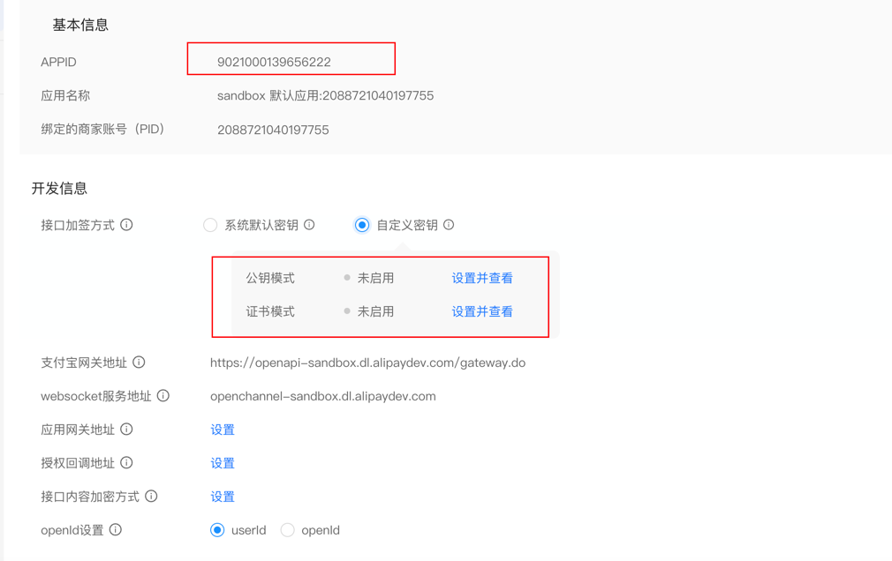

# Alipay Sandbox DDD

## 1. 创建应用
控制台首页, https://open.alipay.com/develop/manage, 下拉找到沙箱；
创建沙箱应用，https://open.alipay.com/platform/appDaily.htm


## 2. 创建密钥
https://opendocs.alipay.com/common/02khjo
复制到网页得到支付宝公钥；


## 3. 编写测试用例
总pom引入sdk,app模块也引入
```yaml
<dependency>
    <groupId>com.alipay.sdk</groupId>
    <artifactId>alipay-sdk-java</artifactId>
    <version>4.38.157.ALL</version>
</dependency>
```
开发文档：
https://opendocs.alipay.com/open/270/105899

## 4. 交易和退款流程图
交易


退款


## todo: 
1. 支付流水单保存；对账；
2. EventBus替换成MQ；
3. 支付sdk替换成v3版本，看了一下，sdk改动挺大，文档写的很拉胯；